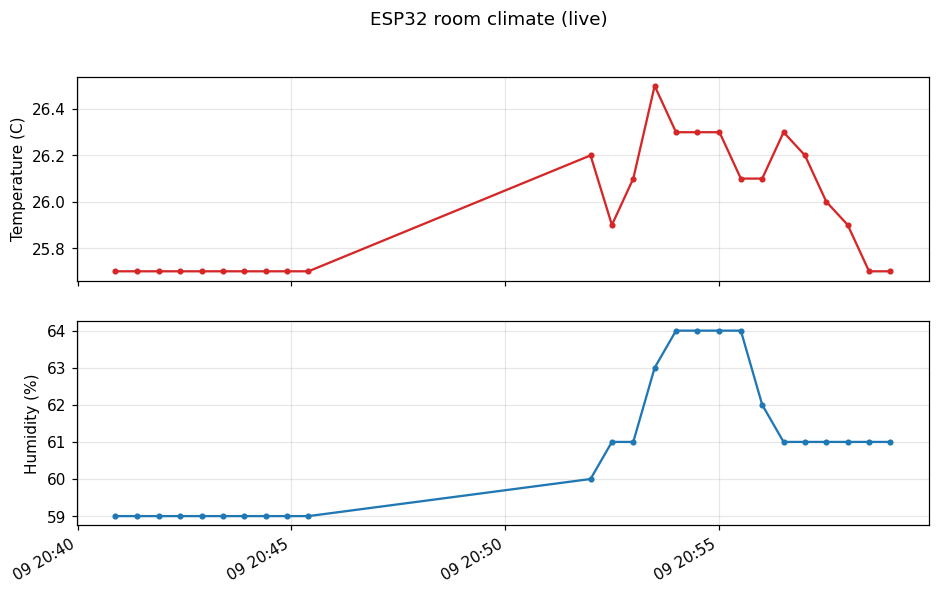

# ESP32 Room Climate Monitor

An end-to-end IoT telemetry pipeline: an ESP32 reads temperature and humidity
from a DHT11 sensor and serves it over WiFi as JSON; a Python poller on a PC
logs readings to CSV; a live matplotlib chart visualizes the history.

```
DHT11 --> ESP32 (HTTP server, /data JSON) --WiFi--> poller.py --> readings.csv --> chart.py
```



*Real capture: stable room baseline, a gap where the poller was stopped, then
a warm-breath test on the sensor — humidity spikes to 64% and decays back.*

## Hardware

- ESP32 DevKit (38-pin) — LAFVIN kit
- DHT11 temperature/humidity module (3-pin, Keyes-style)
  - S -> GPIO 15, middle -> 3V3, minus -> GND

## Firmware (`firmware/esp32_room_climate/`)

Arduino sketch. Serves:

- `GET /` — plain-text hello
- `GET /data` — `{"temperature_c":25.7,"humidity_pct":59.0,"uptime_ms":123456}`,
  or HTTP 503 with an error JSON if the sensor read fails

Setup: copy `secrets.h.example` to `secrets.h`, fill in WiFi credentials,
then compile and upload with the Arduino IDE (board: ESP32 Dev Module).
The device prints its IP on the serial monitor (115200 baud) at boot.

Libraries: DHT sensor library (Adafruit) + Adafruit Unified Sensor.

## PC side (Python 3.9+)

```powershell
python -m venv .venv
.\.venv\Scripts\Activate.ps1
pip install -r requirements.txt

python poller.py   # polls /data every 30s, appends to readings.csv
python chart.py    # live chart of the CSV, updates every 5s (separate window)
```

The poller and chart are independent programs that share only the CSV file;
either can be stopped and restarted without affecting the other.

## Roadmap

- [ ] Firmware: auto-reconnect when WiFi drops
- [ ] Firmware: replace `delay()` with `millis()`-based timing
- [ ] Stable addressing (mDNS or static IP)
- [ ] Anomaly detection over the CSV history
- [ ] Plain-English summaries of sensor history via the Claude API

## License

Everything in this repository from this change on is under the
[PolyForm Noncommercial License 1.0.0](LICENSE). Earlier commits were released
under the Apache License 2.0 and stay under it. In plain terms: it is free for
any noncommercial purpose, and for schools and universities, public research
organizations, government institutions and charities, whatever their funding.
Commercial use needs a license from the author: ask through
[the issue tracker](https://github.com/MichaelFowler1/esp32-telemetry/issues). Anyone who
passes on a copy has to pass on the license and the `Required Notice:` line in
[NOTICE](NOTICE). This is a plain summary; the LICENSE file is what governs.
